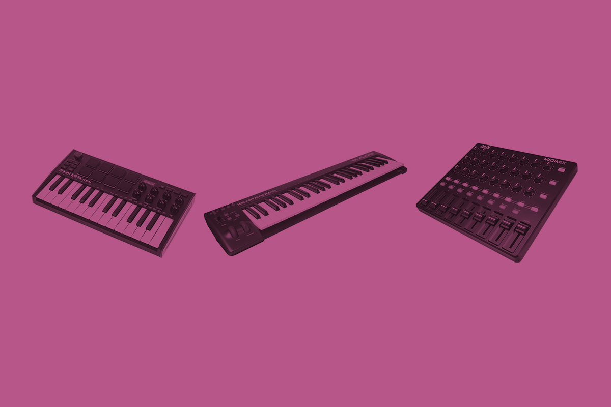

# Music Portfolio Page



## Development

This site is made with [11ty](https://www.11ty.dev/).

```sh
npm install
npm run dev
```

Music data is saved inside `_data/music.json` in the following format:

```json
{
  "title": "Secret Places",
  "id": "secret-places",
  "links": [
    {
      "title": "SoundCloud",
      "url": "https://soundcloud.com/stefanbohacek/secret-places?in=stefanbohacek/sets/mixtape"        
    },
    {
      "title": "Bandcamp",
      "url": "https://stefanbohacek.bandcamp.com/track/secret-places"        
    },
    {
      "title": "Bandwagon",
      "url": "https://bandwagon.fm/66e38b044c86ea48ed036c27"        
    },
    {
      "title": "Mirlo",
      "url": "https://mirlo.space/stefan/release/secret-places"        
    }
  ]
}
```

The `id` of the song will be used to fetch the MP3 song file and cover art.

- `/assets/covers/{{ song.id }}.png`
- `/assets/audio/{{ song.id }}.mp3`
